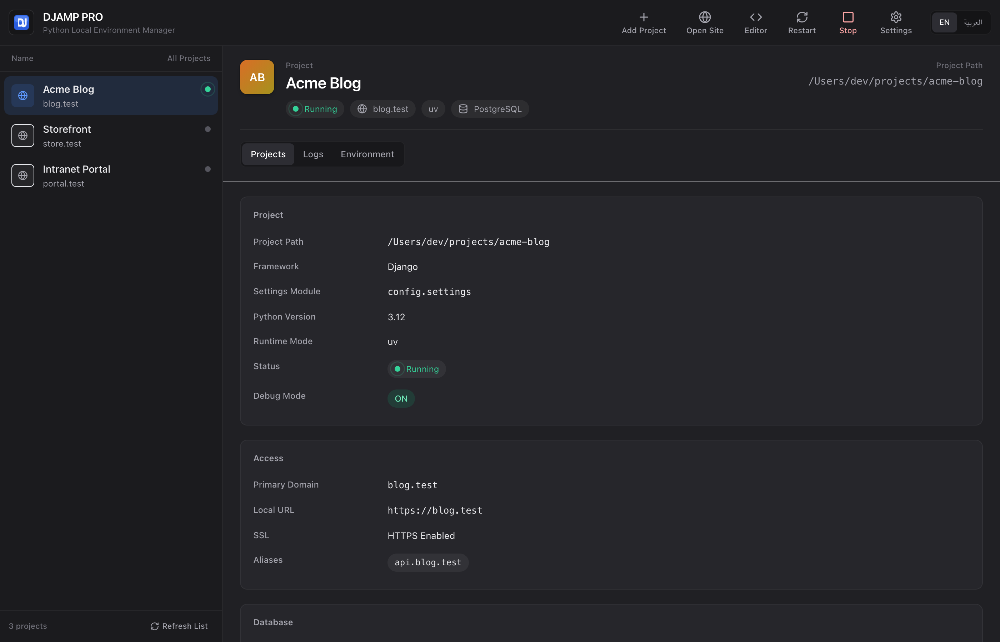

<div align="center">



# DJAMP PRO

### The open-source, MAMP PRO–style control panel for Django, FastAPI & Flask

Run all your Python web projects on real domains with trusted local HTTPS — from one desktop app.
No more juggling `localhost:8000`, hand-editing `/etc/hosts`, or fighting self-signed certs.

[](https://github.com/MohamedMohana/djamp-pro/releases/latest)
[](https://github.com/MohamedMohana/djamp-pro/releases)
[](https://github.com/MohamedMohana/djamp-pro/actions/workflows/ci.yml)
[](LICENSE)
[](https://github.com/MohamedMohana/djamp-pro/stargazers)

**[⬇️ Download for macOS](https://github.com/MohamedMohana/djamp-pro/releases/latest)** ·
**[🚀 Quickstart](#quickstart)** ·
**[📖 Docs](#documentation)** ·
**[🏗️ Architecture](#architecture)** ·
**[🤝 Contributing](#contributing)**

<sub>Built with Tauri · React · FastAPI · Rust · Caddy</sub>

</div>

---

## What is DJAMP PRO?

DJAMP PRO is a desktop app that gives every Python web project the "it just works" local workflow that MAMP PRO gave PHP — **but open source, and built for Django, FastAPI, Flask, and any ASGI/WSGI app.**

Point it at a project folder and it detects the framework — `manage.py` + settings module for Django, or the app object (e.g. `main:app`) for FastAPI/Flask/ASGI/WSGI — gives the app a real domain like `https://myapp.test`, issues a locally trusted HTTPS certificate, wires the database from your `.env`, and runs everything behind a managed Caddy proxy. Start, stop, migrate, open a shell, or tail logs — all from one panel, for as many projects as you want, at the same time.

> **Local development only.** DJAMP PRO is a developer tool for your machine — not a production hosting stack.

## Why not just `runserver`?

| | `manage.py runserver` | **DJAMP PRO** |
|---|---|---|
| Run many projects at once | One terminal + one port each | One panel, all projects together |
| Real domains (`myapp.test`) | Hand-edit `/etc/hosts` + a proxy | Managed automatically |
| Trusted local HTTPS | DIY certs & browser warnings | Local root CA + per-domain certs |
| Serve on ports 80/443 | `sudo` every time | One-time helper, MAMP-style |
| Database setup | Create role/DB by hand | Reads `.env`, auto-provisions Postgres |
| migrate / collectstatic / shell | Retype terminal commands | One click per project |
| Logs | Scattered across terminals | Unified Django / proxy / DB tabs |

## Features

- 🗂️ **Multi-project control panel** — add existing Django, FastAPI, or Flask projects from disk and run them concurrently, virtual-host style.
- 🔍 **Auto-detection** — finds `manage.py` + settings modules (Django) or the app object like `main:app` (FastAPI/Flask/ASGI/WSGI) for you.
- 🐍 **Multi-framework** — Django runs via `runserver`, FastAPI and generic ASGI/WSGI apps via `uvicorn`, Flask via `flask run`; migrations work through Django, Alembic, or Flask-Migrate.
- 🌐 **Domain-first workflow** — per-project primary domain + aliases (e.g. `myapp.test`, `api.myapp.test`), synced into `/etc/hosts` behind a scoped managed block.
- 🔒 **Trusted local HTTPS** — a DJAMP-managed root CA issues per-domain certificates; Caddy serves TLS automatically.
- ⚡ **Flexible runtimes** — `uv` (recommended), `conda`, system Python, or a custom interpreter path — per project.
- 🐘 **Database wiring from `.env`** — reads `DB_*` / `DATABASE_URL`, and can create a missing PostgreSQL role/database for you.
- 🎛️ **One-click actions** — migrate, collectstatic, shell, DB shell, and open in VS Code.
- 📜 **Unified logs** — Django, proxy (Caddy), and database output in one place.
- 🔑 **Environment inspector** — view `.env` keys with sensitive values masked.
- 🛡️ **Least-privilege design** — the app and sidecar run unprivileged; only specific flows (cert install, `/etc/hosts`, ports 80/443) touch a small, isolated macOS helper.
- 🌍 **Bilingual UI** — full English and Arabic (RTL) support.

## Install

### Recommended: download the app (macOS)

Grab the latest signed build from the **[Releases page](https://github.com/MohamedMohana/djamp-pro/releases/latest)** — download the `.dmg`, drag DJAMP PRO to Applications, and launch it. Every release ships a `SHA256SUMS.txt` so you can verify the download.

> Platform focus is **macOS (Apple Silicon)** today. Windows and Linux support are on the roadmap.

### Build from source

See [Quickstart](#quickstart) below, or [`docs/BUILD.md`](docs/BUILD.md) for packaging installers.

## Quickstart

**Requirements:** Node.js 18+, npm, Python 3.10+, and the Rust toolchain (for the Tauri/native pieces). Recommended extras: [`uv`](https://github.com/astral-sh/uv), `psql` + `pg_isready`, and the `code` CLI for VS Code integration.

```bash
# 1. Install JS dependencies
npm install
npm --prefix apps/desktop install

# 2. Create the controller (sidecar) virtualenv
python3 -m venv services/controller/.venv
services/controller/.venv/bin/python -m pip install -r services/controller/requirements-dev.txt

# 3. Run the desktop app (starts the sidecar on 127.0.0.1:8765 automatically)
npm run dev
```

Then add your first project:

1. Click **Add Project** and select a Django, FastAPI, or Flask project folder.
2. Confirm the detected framework — `manage.py` + settings module for Django, or the `module:app` object otherwise.
3. Choose a domain (prefer a `.test` TLD) and a runtime mode.
4. Pick the database type and create the project.
5. Hit **Start** — then open `https://<your-domain>` (or the `:8443` fallback when standard ports are off).

New to it? The **[5-minute guide](docs/QUICKSTART_5_MIN.md)** and **[macOS install notes](docs/INSTALL_MACOS.md)** walk through it step by step.

## Architecture

DJAMP PRO is a Tauri desktop shell talking to a local FastAPI sidecar, which orchestrates Caddy, your Django processes, and local databases.

```text
┌──────────────── DJAMP PRO Desktop (Tauri + React) ────────────────┐
│  UI: projects · settings · logs · environment                     │
│                         │  Tauri invoke() commands                 │
└─────────────────────────┼─────────────────────────────────────────┘
                          ▼
        FastAPI Sidecar Controller  (127.0.0.1:8765)
        · project registry          · Caddy config gen + reload
        · runtime orchestration     · cert + CA operations
        · database provisioning     · privileged-helper bridge
                          │
        ┌─────────────────┼─────────────────┐
        ▼                 ▼                 ▼
    Caddy Proxy      Django processes   Local DB services
  (domains + TLS)     (per project)    (primarily Postgres)
        │
        ▼
   Browser on your custom local domains (https://myapp.test)
```

On macOS, a small **Rust privileged helper** handles the few operations that need elevation — editing `/etc/hosts` and binding ports 80/443 — so the main app never runs as root. See [`docs/ARCHITECTURE.md`](docs/ARCHITECTURE.md) for the full picture.

### Repository layout

```text
apps/desktop/            # Tauri host + React frontend
services/
  controller/            # FastAPI sidecar (project/proxy/cert/DB orchestration)
  priv-helper/           # macOS privileged helper daemon (Rust)
bundles/                 # Optional bundled binaries (e.g. Caddy)
scripts/djamp-pro/       # Cert / CA / hosts helper scripts
docs/                    # Architecture, build, install, FAQ, troubleshooting
```

## How it works

<details>
<summary><b>Domains &amp; HTTPS</b></summary>

<br>

- Each project gets a primary domain plus optional aliases.
- Host entries are synced into `/etc/hosts` inside a scoped managed block:
  ```text
  # BEGIN DJAMP PRO MANAGED
  127.0.0.1 myapp.test
  # END DJAMP PRO MANAGED
  ```
- A DJAMP-managed **root CA** issues a certificate per domain; Caddy serves TLS and routes the domain to the project's Django port.

**Tips**

- Prefer local dev TLDs like `.test`. Public domains can hit HSTS/preload/policy limits.
- Browsers cache TLS state aggressively — if a cert looks stale, regenerate it, restart the project, and hard-refresh (`Cmd+Shift+R`).

</details>

<details>
<summary><b>Standard ports (80/443)</b></summary>

<br>

- The proxy defaults to internal ports **8080 (HTTP)** and **8443 (HTTPS)**.
- On macOS, the helper can enable MAMP-style behavior on the real ports 80/443.
- When standard ports aren't active, DJAMP PRO opens the fallback URL with the explicit proxy port (e.g. `https://myapp.test:8443`).

</details>

<details>
<summary><b>Database behavior</b></summary>

<br>

DJAMP PRO reads DB credentials from a project's `.env` when present: `DB_NAME`, `DB_USER`, `DB_PASSWORD`, or `DATABASE_URL`.

For the PostgreSQL workflow it:

- routes to a managed local Postgres service,
- creates a missing role/database when needed, and
- keeps a managed `.env` block aligned to the local host/port.

**Web DB admin** is exposed on the project domain (path-style routing: `/phpmyadmin/`, `/phpMyAdmin/`, `/phpMyAdmin5/`) and requires the project to be running.

</details>

<details>
<summary><b>Data locations</b></summary>

<br>

App data root:

- macOS: `~/Library/Application Support/DJAMP PRO/`
- Windows: `%APPDATA%/DJAMP PRO/`

Key files:

- `registry.json` — project registry
- `certs/` — generated certificates
- `caddy/Caddyfile` — proxy config
- `logs/django/`, `logs/proxy/`, `logs/database/` — per-source logs

</details>

<details>
<summary><b>Build &amp; packaging</b></summary>

<br>

```bash
# Validate
npm --prefix apps/desktop run lint
npm --prefix apps/desktop run typecheck
cargo check --manifest-path apps/desktop/src-tauri/Cargo.toml
services/controller/.venv/bin/python -m pytest services/controller/tests -q

# Build the desktop app + installer
npm --prefix apps/desktop run build
npm --prefix apps/desktop run tauri:build
```

Installer artifacts are produced under the Tauri target bundle directories. Full details in [`docs/BUILD.md`](docs/BUILD.md).

</details>

## Troubleshooting

<details>
<summary><b>Common issues &amp; quick fixes</b></summary>

<br>

**Domain resolves but the app doesn't load**
- Confirm the project status is `running`.
- Check the Caddy and Django output in the **Logs** tab.

**`ERR_NAME_NOT_RESOLVED`**
- Re-sync hosts from **Settings** and confirm the managed block exists in `/etc/hosts`.
- Flush DNS on macOS:
  ```bash
  sudo dscacheutil -flushcache
  sudo killall -HUP mDNSResponder
  ```

**TLS warnings / cert issues**
- Install the CA from **Settings**, regenerate the project cert, restart the project, and hard-refresh (`Cmd+Shift+R`).

**Helper install appears stuck** — check these paths and the log:
```bash
ls -l /Library/PrivilegedHelperTools/com.djamp.pro.helperd
ls -l /Library/LaunchDaemons/com.djamp.pro.helperd.plist
sudo tail -n 200 /var/log/djamp-pro-helper.log
```

**Health checks**
```bash
curl -s http://127.0.0.1:8765/health
lsof -nP -iTCP:8443 -sTCP:LISTEN   # is the HTTPS proxy port listening?
```

</details>

More in [`docs/TROUBLESHOOTING.md`](docs/TROUBLESHOOTING.md) and [`docs/FAQs.md`](docs/FAQs.md).

## Roadmap & limitations

- Windows and Linux parity are in progress (macOS-first today).
- Web DB admin is PostgreSQL-focused; full phpMyAdmin parity isn't a goal for Postgres mode.
- Installer signing/notarization hardening is ongoing.

Releases follow semantic tags (`vMAJOR.MINOR.PATCH`); see the [Releases page](https://github.com/MohamedMohana/djamp-pro/releases) for notes.

## Documentation

| Guide | What it covers |
|---|---|
| [Quickstart (5 min)](docs/QUICKSTART_5_MIN.md) | Fastest path from clone to a running project |
| [macOS install](docs/INSTALL_MACOS.md) | Requirements and setup on macOS |
| [Architecture](docs/ARCHITECTURE.md) | How the desktop app, sidecar, and helper fit together |
| [Build](docs/BUILD.md) | Building and packaging installers |
| [Troubleshooting](docs/TROUBLESHOOTING.md) · [FAQ](docs/FAQs.md) | Fixes and common questions |
| [Uninstall](docs/UNINSTALL.md) | Clean removal |

## Contributing

Contributions are welcome — whether it's a bug report, a docs fix, or a feature PR.

- Read the [Contributing guide](.github/CONTRIBUTING.md) to get set up.
- Check [open issues](https://github.com/MohamedMohana/djamp-pro/issues) for a place to start.
- Please follow our [Code of Conduct](.github/CODE_OF_CONDUCT.md).

Found a security issue? Please follow the [Security policy](.github/SECURITY.md) rather than opening a public issue.

## Community & support

- 💬 [Discussions & issues](https://github.com/MohamedMohana/djamp-pro/issues)
- 🛟 [Support policy](.github/SUPPORT.md)
- 🔐 [Security policy](.github/SECURITY.md)

If DJAMP PRO saves you time, a ⭐ helps others discover it.

## License

Released under the [MIT License](LICENSE) — free to use, modify, and distribute.

<div align="center">
<sub>Built for the Django community. Star it, fork it, make it yours.</sub>
</div>
